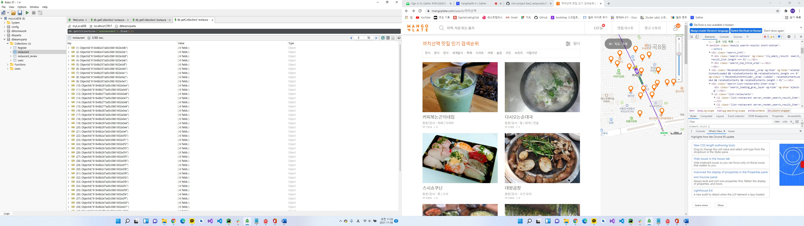
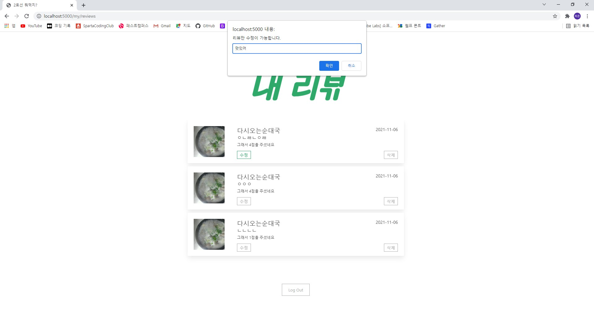
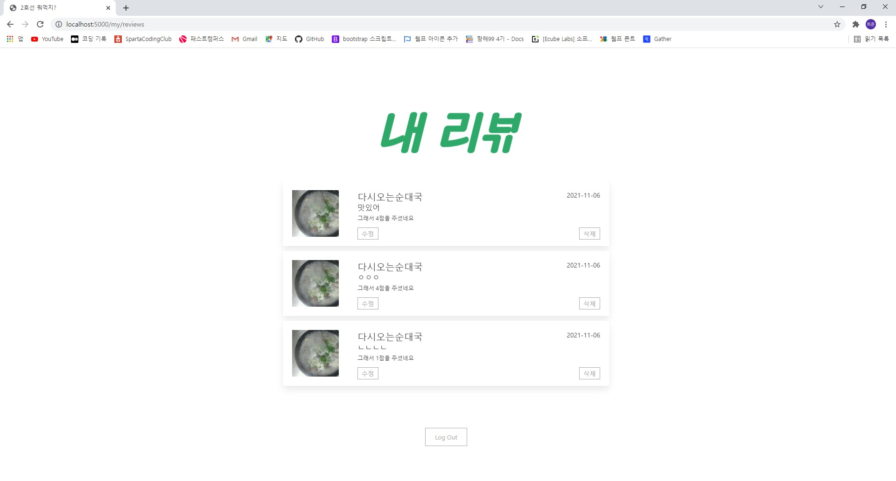
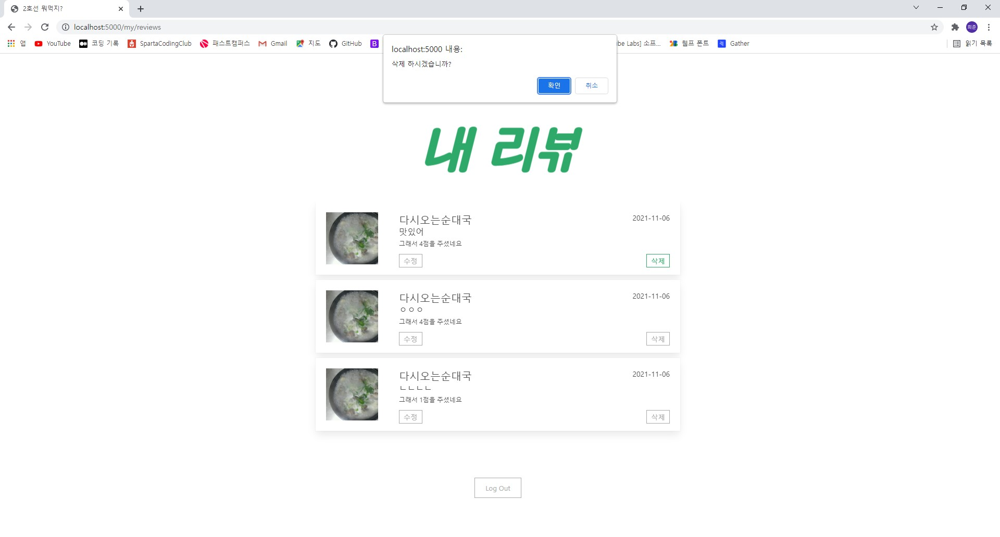
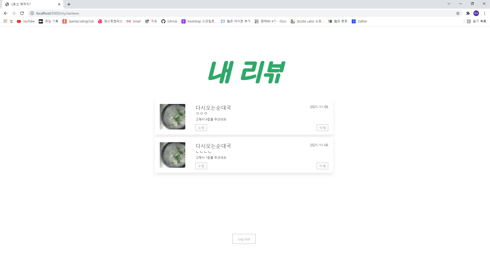

# hanghae99

<h1>17조 팀프로젝트</h1>
프로젝트 명: 2호선 뭐먹지
<h3>17조 팀프로젝트에서 제가 맡았던 역활은 <b><i>크롤링, myReview페이지 제작</i></b> 을 대표로 맡았습니다</h3>
<ol type="1">
    <li> 크롤링
        <ul>
            <li>망고플레이트라는 사이트에서 2호선의 역중 14개의 역을 임이로 선정해 크롤링해서 DB에 저장시켰습니다

   
        </ul>
    <li> 리뷰 페이지에서 내 리뷰를 모아서볼 수 있고 수정 및 삭제가 가능하게 하였습니다
        <ul>
            <li>myReview 리뷰 모아보기</li>
        

    <li>수정 기능 입니다</li>

  prompt()를 띄워서 새로운 리뷰를 입력받으면 
DB에 해당 리뷰의 id값에 있는 기존 리뷰를 입력한 새로운 리뷰로 초기화를 했습니다.  

    <li>삭제 기능 입니다</li>

        </ul>
</oi>

